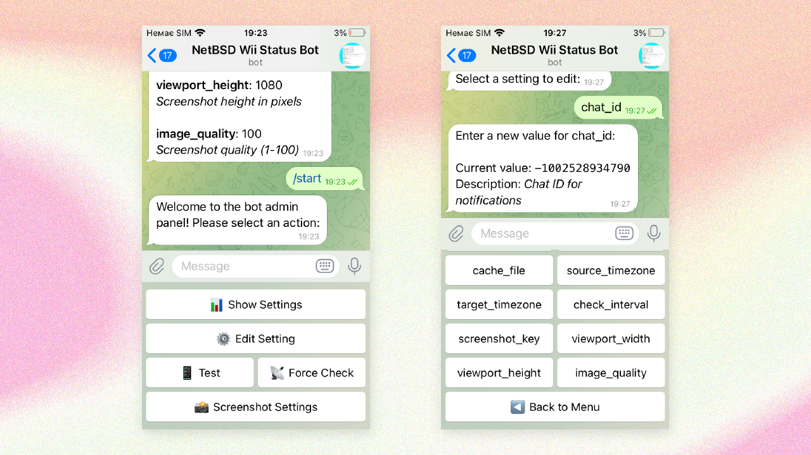

# NetBSD Wii Status Monitor Telegram Bot

> [!WARNING]
> This branch of the repository for PHP 7.3.10 is deprecated and will no longer receive updates. It is created solely to run on older Linux distributions.

This Telegram bot monitors the live status page of a website hosted on a Nintendo Wii running NetBSD, as described in [Alex Haydock's blog post](https://blog.infected.systems/posts/2025-04-21-this-blog-is-hosted-on-a-nintendo-wii). The bot periodically checks for updates, captures a screenshot of the status page, and sends it to a specified Telegram channel. It also provides an administrative interface within Telegram for managing the bot's settings.

## Features

- **Automated Monitoring:** Periodically checks the target website for updates based on a timestamp.
- **Screenshot Capture:** Takes a screenshot of the status page using the [ScreenshotOne API](https://screenshotone.com/).
- **Telegram Notifications:** Sends a message with the captured screenshot to a designated Telegram channel whenever a new update is detected.
- **Administrative Interface:** Provides a Telegram-based interface for administrators to:
  - View current bot settings.
  - Edit various settings (check URL, chat ID, API keys, timezone settings, screenshot dimensions and quality, check interval).
  - Manually trigger a test of the bot's functionality.
  - Force an immediate check of the website.
- **Configuration via Database:** Uses an SQLite database to store and manage bot settings, allowing for easy modification without code changes.
- **Timezone Conversion:** Converts the timestamp found on the status page to a specified target timezone for more informative notifications.
- **Error Handling and Logging:** Includes basic error handling and logging for debugging purposes.

## Getting Started

### Prerequisites

- PHP 7.4 or higher **(or PHP 7.3 for legacy support)** with the following extensions enabled:
  - `curl`
  - `sqlite3`
- Composer
- A Telegram bot token (create one with [BotFather](https://t.me/BotFather))
- An API key from [ScreenshotOne](https://screenshotone.com/) to capture website screenshots. You will need to sign up for an account to obtain an API key.

### Installation

1. Clone the repository:
   ```bash
   git clone https://github.com/ChernegaSergiy/netbsd-wii-monitor-bot.git
   cd netbsd-wii-monitor-bot
   ```

2. Install dependencies:
   ```bash
   composer require telegram-bot/api
   composer install
   ```

3. Configure your Telegram bot token in the `$botToken` variable and the initial administrator Telegram User IDs in the `$adminIds` array within the `wiim.php` file. **Note:** It is highly recommended to manage most settings through the bot's admin interface after the initial setup.

4. Initialize the SQLite database: The database (`bot_config.db`) will be automatically created and populated with default settings when you run the bot for the first time.

5. Run the bot:
   ```bash
   php wiim.php
   ```

### Administrative Interface

Most of the bot's configuration can be done through the administrative interface within Telegram. To access it, send the `/start` command to your bot as an authorized administrator (your Telegram User ID needs to be in the `$adminIds` array in the `wiim.php` file).

The following settings can be managed:

- **Check URL:** The URL of the status page to monitor (e.g., `https://blog.infected.systems/status`).
- **Chat ID:** The ID of the Telegram channel or chat where notifications should be sent.
- **Cache File:** The local file used to store the last detected timestamp.
- **Source Timezone:** The timezone of the timestamp on the monitored website (e.g., `UTC`).
- **Target Timezone:** The timezone to which the timestamp should be converted in notifications (e.g., `Europe/Kiev`).
- **Check Interval:** The frequency (in seconds) at which the website should be checked for updates.
- **Screenshot Key:** Your API key from [ScreenshotOne](https://screenshotone.com/).
- **Viewport Width:** The width (in pixels) of the virtual browser viewport used for taking screenshots.
- **Viewport Height:** The height (in pixels) of the virtual browser viewport used for taking screenshots.
- **Image Quality:** The quality of the captured JPEG screenshot (1-100).

#### Screenshot of the Admin Panel

  
*Telegram bot admin panel: view and manage bot settings via an intuitive inline keyboard interface*

## Contributing

Contributions are welcome and appreciated! Here's how you can contribute:

1. Fork the project
2. Create your feature branch (`git checkout -b feature/AmazingFeature`)
3. Commit your changes (`git commit -m 'Add some AmazingFeature'`)
4. Push to the branch (`git push origin feature/AmazingFeature`)
5. Open a Pull Request

Please make sure to update tests as appropriate and adhere to the existing coding style.

## License

This project is licensed under the CSSM Unlimited License v2 (CSSM-ULv2). See the [LICENSE](LICENSE) file for details.

## Acknowledgments

- [Alex Haydock](https://github.com/alexhaydock) for the inspiring project of hosting a blog on a Nintendo Wii.
- [Telegram Bot API](https://core.telegram.org/bots/api) for enabling bot functionality on Telegram.
- [ScreenshotOne API](https://screenshotone.com/) for providing the service used to capture website screenshots.
- Special thanks to the open-source community for their contributions and support.
