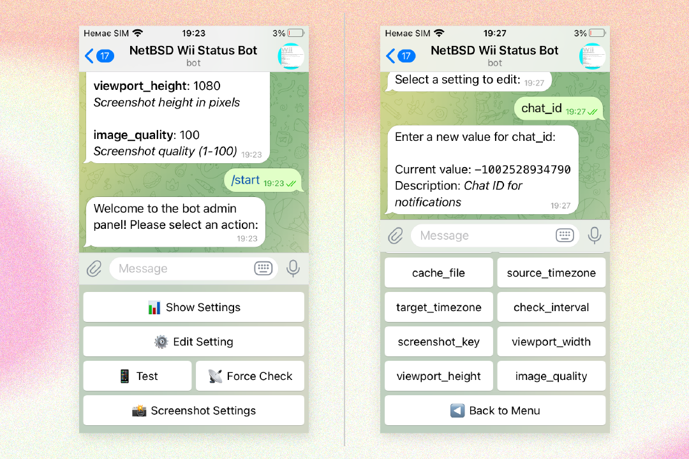

# NetBSD Wii Status Monitor Telegram Bot

This Telegram bot monitors the live status page of a website hosted on a Nintendo Wii running NetBSD, as described in [Alex Haydock's blog post](https://blog.infected.systems/posts/2025-04-21-this-blog-is-hosted-on-a-nintendo-wii). The bot periodically checks for updates, captures a screenshot of the status page, and sends it to a specified Telegram channel. It also provides an administrative interface within Telegram for managing the bot's settings.

## Features

- **Automated Monitoring:** Periodically checks the target website for updates based on a timestamp.
- **Screenshot Capture:** Takes a screenshot of the status page using Puppeteer, which can be run locally or on a remote server.
- **Telegram Notifications:** Sends a message with the captured screenshot to a designated Telegram channel whenever a new update is detected.
- **Administrative Interface:** Provides a Telegram-based interface for administrators to:
  - View current bot settings.
  - Edit various settings (check URL, chat ID, Puppeteer server URL, timezone settings, screenshot dimensions and quality, check interval).
  - Manually trigger a test of the bot's functionality.
  - Force an immediate check of the website.
- **Configuration via Database:** Uses an SQLite database to store and manage bot settings, allowing for easy modification without code changes.
- **Timezone Conversion:** Converts the timestamp found on the status page to a specified target timezone for more informative notifications.
- **Error Handling and Logging:** Includes basic error handling and logging for debugging purposes.

## Getting Started

### Prerequisites

- PHP 7.4 or higher with the following extensions enabled:
  - `curl`
  - `sqlite3`
- Composer
- Node.js 14 or higher (for Puppeteer server)
- npm (Node.js package manager)
- A Telegram bot token (create one with [BotFather](https://t.me/BotFather))

### Installation

1. Clone the repository:
   ```bash
   git clone https://github.com/ChernegaSergiy/netbsd-wii-monitor-bot.git
   cd netbsd-wii-monitor-bot
   ```

2. Create an `.env` file in the root directory:
   ```bash
   cp .env.example .env
   ```
   Fill in the necessary values, such as your Telegram bot token.

3. Install dependencies using Composer:
   ```bash
   composer install
   ```

4. Set up and start the Puppeteer screenshot server:
   ```bash
   # Enter the puppeteer-server directory
   cd puppeteer-server

   # Install dependencies
   npm install

   # Start the Puppeteer server
   node puppeteer-server.js
   ```
   The Puppeteer server will run on port 3000 by default. You can change this by setting the `PORT` environment variable.

5. Initialize the SQLite database: The database (`bot_config.db`) will be automatically created and populated with default settings when you run the bot for the first time.

6. Run the bot:
   ```bash
   php wiim.php
   ```

### Administrative Interface

Most of the bot's configuration can be done through the administrative interface within Telegram. To access it, send the `/start` command to your bot as an authorized administrator. 

You need to specify your Telegram User ID in the `ADMIN_IDS` variable of the `.env` file, separated by commas for multiple administrators. For example:
```env
ADMIN_IDS=123456789,987654321
```

The following settings can be managed:

- **Check URL:** The URL of the status page to monitor (e.g., `https://blog.infected.systems/status`).
- **Chat ID:** The ID of the Telegram channel or chat where notifications should be sent.
- **Cache File:** The local file used to store the last detected timestamp.
- **Source Timezone:** The timezone of the timestamp on the monitored website (e.g., `UTC`).
- **Target Timezone:** The timezone to which the timestamp should be converted in notifications (e.g., `Europe/Kiev`).
- **Check Interval:** The frequency (in seconds) at which the website should be checked for updates.
- **Puppeteer Server:** The URL where your Puppeteer screenshot server is running (e.g., `http://localhost:3000` for local setup).
- **Viewport Width:** The width (in pixels) of the virtual browser viewport used for taking screenshots.
- **Viewport Height:** The height (in pixels) of the virtual browser viewport used for taking screenshots.
- **Image Quality:** The quality of the captured JPEG screenshot (1-100).

#### Screenshot of the Admin Panel

  
*Telegram bot admin panel: view and manage bot settings via an intuitive inline keyboard interface*

### Running in Production

When running in a production environment, consider the following:

1. Run the Puppeteer server with PM2 or similar process manager:
   ```bash
   npm install -g pm2
   pm2 start puppeteer-server.js
   ```

2. Use a reverse proxy (like Nginx) to secure the Puppeteer server:
   ```nginx
   location /puppeteer/ {
       proxy_pass http://localhost:3000/;
       proxy_http_version 1.1;
       proxy_set_header Upgrade $http_upgrade;
       proxy_set_header Connection 'upgrade';
       proxy_set_header Host $host;
       proxy_cache_bypass $http_upgrade;
   }
   ```

3. Consider running the Puppeteer server in a Docker container for better isolation.

## Contributing

Contributions are welcome and appreciated! Here's how you can contribute:

1. Fork the project
2. Create your feature branch (`git checkout -b feature/AmazingFeature`)
3. Commit your changes (`git commit -m 'Add some AmazingFeature'`)
4. Push to the branch (`git push origin feature/AmazingFeature`)
5. Open a Pull Request

Please make sure to update tests as appropriate and adhere to the existing coding style.

## License

This project is licensed under the CSSM Unlimited License v2 (CSSM-ULv2). See the [LICENSE](LICENSE) file for details.

## Acknowledgments

- [Alex Haydock](https://github.com/alexhaydock) for the inspiring project of hosting a blog on a Nintendo Wii.
- [Telegram Bot API](https://core.telegram.org/bots/api) for enabling bot functionality on Telegram.
- [Puppeteer](https://pptr.dev/) for providing the powerful browser automation tool used to capture website screenshots.
- Special thanks to the open-source community for their contributions and support.
